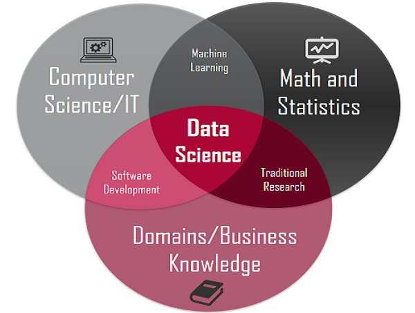
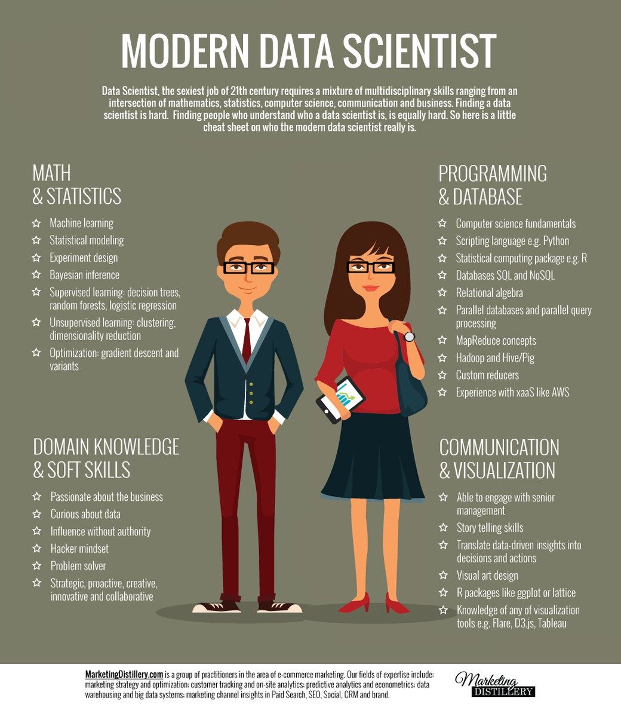
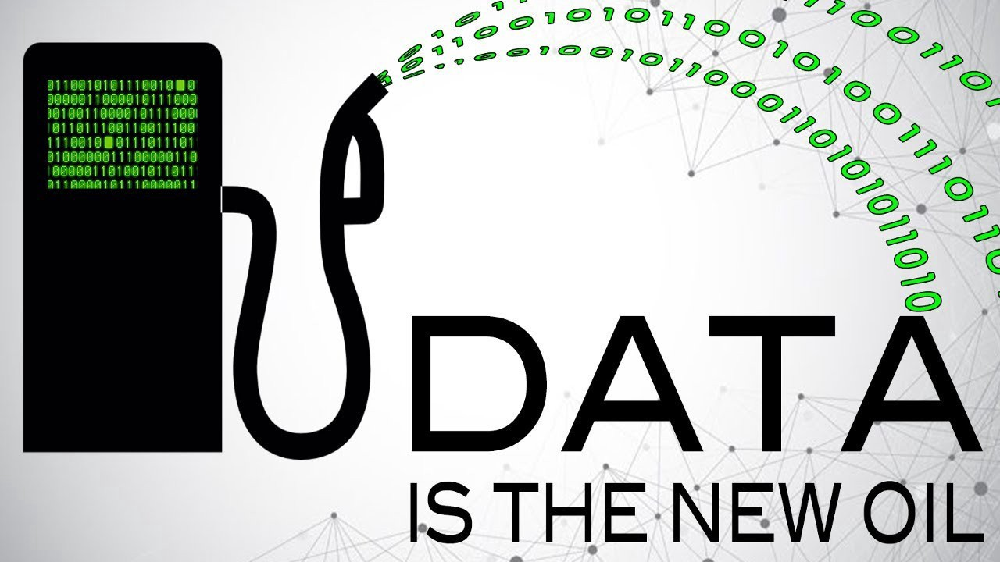

---
output:
  html_document:                    # Classe de documento.
    toc: true                       # Exibir sumário.
    toc_depth: 2                    # Profundidade do sumário.
    toc_float:                      # Sumário flutuante na borda.
      collapsed: false              # Serve para indicar se os "subcapítulos" aparecem sozinhos
      smooth_scroll: true
    number_sections: true           # Se??es numeradas.
    theme: lumen
    # default, cerulean, journal, flatly, readable, spacelab, united, cosmo, lumen, paper, sandstone, simplex, yeti
    highlight: default                # Cores para o destaque de c?digo.
  # "default", "tango", "pygments", "kate",  "monochrome", "espresso", "zenburn", "haddock", "textmate"
    fig_width: 7                    # Lagura das figuras.
    fig_height: 6                   # Altura das figuras.
    fig_caption: true               # Exibica??o de legenda.
    code_folding:              # Esconder/exibir bloco de c?digo.
    keep_md: true                   # Manter o arquivo md.
    #template: quarterly_report.html # Caminho para o template.
---

---

  

---

 **Ciência de Dados: Uma Grande Oportunidade para Estatísticos** 

**João Matheus S. K. T. Hneda | Mar/2019 | PET - Estatística (UFPR)**

---

# Qual é o objetivo desse artigo?

Estatística, Big data, Machine Learning e Ciência de Dados. Esses são alguns dos termos mais falados no mercado de trabalho da Ciência de Dados. Mas qual é o significado de cada uma dessas palavras? O que define um Cientista de Dados (Do inglês, Data Scientist)? Quais são os conhecimentos necessários para que um profissional possa atuar como um Cientista de Dados? Quais são as possibilidades profissionais? Como o estatístico se encontra nesse mercado?

Esse texto tem como objetivo responder essas questões, mostrar algumas definições importantes e resumir algumas informações a respeito do mercado de trabalho da Ciência de Dados. Também é desejado que ao final desse texto, o leitor possa compreender um pouco mais sobre as vantagens de um estatístico aproveitar a alta demanda por Cientista de Dados.

---

# Qual é a situação hoje?

Quase tudo que fazemos hoje deixa um rastro de informação. Todos os aparelhos construídos atualmente, sejam automóveis, celulares, computadores, televisores, geladeiras, etc. liberam dados. A verdade é que nunca medimos tanto as coisas. Isso é algo impressionante. Mas o que são dados? 

Dados são coleções de fatos, tais como, números, palavras, imagens, sons e vídeos. Entretanto, grande parte desses dados é gerada de uma forma não estruturada ou em diferentes formatos, o que dificulta a análise e a possibilidade de transformar os mesmos em informação. Dessa forma, a revolução digital não está nas máquinas que geram os dados e sim na maneira que eles são utilizados. Essa situação traz grandes oportunidades para o profissional que souber fazer uma boa análise e tomar melhores decisões de negócio. Entretanto, poucos profissionais têm as habilidades necessárias para se analisar os dados de forma correta, ao contrário do Estatístico que aprende diferentes técnicas de análise. Mas o que é **Estatística** e quem é o **Estatístico**?

# O que é Estatística?

---

 *A Ciência Estatística pode ser definida como um conjunto de métodos para **coletar, organizar, resumir, interpretar e apresentar** dados, para a utilização dos mesmos na tomada de decisão. Em resumo, é um conjunto de técnicas usadas para se analisar dados.* 

---

Dessa forma, o estatístico é aquele profissional capaz de utilizar esse conjunto de métodos para transformar dados em informação. Dentro desse contexto então, o estatístico pode trabalhar em qualquer área que envolva dados ou como diria John Tukey:

---

 
 <strong> "A melhor coisa sobre ser um estatístico é que você pode atuar no quintal de todo mundo."</strong> 
 
 
 <strong> John Tukey - Estatístico (1915 - 2000) </strong> 
 

---

Mas qual é a diferença do estatístico de hoje em relação ao estatístico do século passado?

As teorias estatísticas servem como base para transformar os dados em informação. Na prática, as técnicas estatísticas são muito importantes quando é desejado que a lógica se prevaleça em relação ao "achismo". Muitas das técnicas estatísticas foram desenvolvidas ao longo do século XX, o que aumentou a confiabilidade das pesquisas e, portanto, seus resultados. Estatística Descritiva, Medidas-Resumo, Teoria das Probabilidades, Inferência Estatística, Técnicas de Amostragem, Regressão Linear e Não-Linear são algumas das técnicas mais utilizadas pelos estatísticos. Mas fica a pergunta: Se as técnicas são antigas, qual é a diferença do estatístico dos dias atuais em relação ao estatístico do século passado? Duas palavras: **Big Data.**

# O que é Big Data?

---

 *Big Data é uma coleção de conjuntos de dados, grandes e complexos, que não podem ser processados por bancos de dados ou aplicações de processamentos tradicionais.* 

---

Mas por que o Big Data tem se tornado tão importante?

É sabido que com aquisição de conhecimento e educação, o nosso potencial de crescimento na vida aumentará. Dessa forma, sabe-se que conhecimento é poder. E o conhecimento provém de um conjunto de informações. E as informações são interpretadas a partir dos dados. E uma grande quantidade de dados é o que define o Big Data. Com isso, a relação entre o Big Data e conhecimento se estabelece conforme a imagem abaixo.

A realidade é que novas tecnologias permitem processar uma grande quantidade de dados de forma eficiente e com baixo custo, responder ao aumento da velocidade da geração dos dados e coletar dados de diferentes formatos e fontes. Tecnologias como o Apache Hadoop e Apache Spark são muito importantes para processar essa grande quantidade de dados com armazenamento e processamento distribuído.

Dessa forma, como o estatístico é o profissional mais habilitado a encontrar insights a partir dos dados, esse profissional também deve aprender técnicas da Ciência da Computação para o processamento eficiente dos mesmos. Portanto, sabe-se que o Big Data é o combustível para o trabalho do estatístico. E quando essas duas ciências se unem, temos como resultado um método de análise de dados que automatiza a construção de modelos analíticos. A isso dá-se o nome de **Aprendizado de Máquina (Do inglês Machine Learning).**

# O que é Machine Learning? 

---

  

---

Para definir o que é Aprendizado de Máquina (Machine Learning), é necessário primeiro definir o que é Aprendizado. Aprendizado é a capacidade de se adaptar, modificar e melhorar seu comportamento e suas respostas. É portanto uma das propriedades mais importantes dos seres dito inteligentes, sejam eles humanos ou não. 

---

 *Dessa forma, **Machine Learning** oferece métodos de análise que permitem dar aos computadores a capacidade de aprender e a encontrar insights de forma que possam melhorar o desenvolvimento de modelos analíticos por meio da automatização. Em outras palavras, é um ramo da inteligência artificial baseado na ideia de que sistemas podem aprender com dados, identificar padrões e tomar decisões com o mínimo de intervenção humana sem que sejam explicitamente programados para isso.* 

---

  

Tudo começou em 1959 com o pioneiro da inteligência artificial, [Arthur Samuel](https://www.ibm.com/developerworks/community/blogs/jfp/entry/What_Is_Machine_Learning?lang=en), engenheiro do MIT. Foi ele quem criou o termo "machine learning" naquele mesmo ano, descrevendo o conceito como "um campo de estudo que dá aos computadores a habilidade de aprender sem terem sido programados para tal". Na época, Samuel trabalhava em um projeto para criar uma máquina autônoma com estas características.

E o que permitiu o Machine Learning crescer tanto? Por que esse assunto é tão famoso? Novamente, as mesmas duas palavras: **Big Data.** Com o advento da internet, o Machine Learning começou a tomar forma, já que, com tanta informação coletada e armazenada na web, foi preciso criar meios de organizar esse conteúdo gigantesco de maneira automatizada. Foi nesse momento que o termo Ciência de Dados começou a aparecer e o profissional chamado Cientista de Dados começou a ficar famoso.

# O que é Ciência de Dados? 

---

  

---

 *Ciência de Dados é uma grande disciplina em si e consiste em conjuntos de habilidades especializadas, tais como: Estatística, Matemática, Programação, Computação e Conhecimento de Negócios, além de técnicas e teorias, como a Análise Preditiva, Modelagem, Engenharia e Mineração de Dados e Visualização.* 

---

## Ok, entendi. Então quem é o Cientista de Dados?

Na verdade, o termo Cientista de Dados surgiu pela primeira vez em 2011 como aquele profissional que era apto a utilizar Ciência de Dados (Do inglês, Data Science) para analisar Big Data. Entretanto, o termo explodiu em 2012, quando a frase abaixo foi divulgada:

 
 <strong> ["Data Scientist is the sexiest job of the 21st century" - Harvard Business Review](https://hbr.org/2012/10/data-scientist-the-sexiest-job-of-the-21st-century) </strong> 
 

---

 *Dessa forma, o Cientista de Dados é o profissional que consegue unir conjuntos de diferentes habilidades, tais como: Estatística, Matemática, Programação, Computação e Conhecimento de Negócios. É uma nova geração de [profissionais analíticos](https://www.gazetadopovo.com.br/economia/livre-iniciativa/carreira-e-concursos/os-19-cargos-que-estarao-em-alta-para-contratacao-em-2019-6s2ajzpy08a2ltmqo8r0sm1sq/?utm_source=linkedin&utm_medium=midia-social&utm_campaign=gazeta-do-povo) que tem as habilidades técnicas para resolver problemas complexos.* 

---

  

---

# E quais são as possibilidades profissionais?

Se o profissional tiver domínio das técnicas que podem ser utilizadas com Estatística e Ciência da Computação, o mesmo deverá escolher a área em que aplicará os seus conhecimentos e se especializar nela. Como ilustração, abaixo encontram-se alguns exemplos de atividades que o Cientista de Dados pode realizar e áreas em que pode atuar.

## Setor Financeiro

- Predizer o crescimento econômico de um país ou o preço de commodities agrícolas do mercado financeiro.
- Detectar fraudes em operações financeiras como a compra e venda de ações.
- Analisar o risco de operações com alto potencial de ganho.

## Varejo

- Análise de sentimento de determinada marca e conhecer se os produtos são aprovados pelos clientes.
- Recomendação individualizada de algum produto com base em pesquisas e compras anteriores.
- Cálculo da probabilidade de retenção de algum cliente.

## Saúde

- Monitoramento de Sinais Vitais;
- Análise da relação entre o consumo de cigarro e o tempo de vida medido em anos.
- Redução da taxa de retorno de pacientes.
- Verificação do efeito de Medicamentos Personalizados.

## Telecomunicações

- Análise do registro de ligações.
- Geolocalização de ligações.
- Ofertas personalizadas de produtos.

## Educação

- Orientação em tempo real para que o aluno não abandone a escola.
- Personalização  do processo de aprendizagem.
- Monitoramento do estudante na sua vida acadêmica.

---

# [Data is the new oil?](https://medium.com/@adeolaadesina/data-is-the-new-oil-2947ed8804f6)

---

  

---

É conhecido que as companhias petrolíferas dominavam o mundo. Sem o petróleo não haveria avanço industrial e econômico. Entretanto, era necessário que o petróleo fosse refinado para que o querosene e gasolina pudessem ser utilizados. Em outras palavras, necessitava-se de alguém que pudesse manusear o produto e gerar valor com seus derivados. Um dos precursores no refino do petróleo foi John Davison Rockefeller. Mas quem era **[John D. Rockefeller?](https://www.ebiografia.com/john_rockefeller/)** Rockefeller (1839-1937) foi um investidor e empresário norte-americano. Rockefeller revolucionou o setor do petróleo. Em 1870, fundou a Standard Oil Company e a comandou agressivamente até sua aposentadoria oficial em 1897. Como a importância do querosene e da gasolina estava em alta, a riqueza de Rockefeller cresceu e ele se tornou o homem mais rico do mundo e o primeiro americano a ter mais de um bilhão de dólares. Rockefeller tinha tanta influência no setor petrolífero que chegou a ser obrigado pelo governo americano, em 1911, a desmembrar-se em diversas outras empresas na tentativa de reduzir o poderio econômico e influência de seu cartel no mundo e, principalmente, nos Estados Unidos. 

## Tá, mas o que isso tem a ver com o Estatístico e Ciência de Dados?

Simples... John D. Rockefeller sabia o significado do trabalho duro e do "timing" com relação a exploração de Petróleo. Antes dele, ninguém tinha revolucionado o mercado petrolífero de forma tão fenomenal como ele fez. O mesmo vale para o Estatístico nos dias de hoje. O petróleo precisava ser manuseado para a fabricação de querosene e gasolina. De modo análogo, os dados brutos precisam ser manuseados de forma que possam trazer alguma informação útil e auxiliar na tomada de decisão. Em outras palavras, **Dados são o 'Novo Petróleo' (Do inglês, Data is the New Oil)**. Leia novamente a definição de Estatística. Perceba como ela tem grande peso no mercado da Ciência de Dados. Ou como o [Presidente da American Statistical Association (ASA) - David Morganstein - afirmou:](https://community.amstat.org/blogs/ronald-wasserstein/2015/10/01/the-role-of-statistics-in-data-science-an-asa-statement)

---

 *Através desta declaração, a ASA e seus membros reconhecem que a Ciência de Dados abrange mais do que Estatística, mas ao mesmo tempo também reconhece que a Estatística desempenha um papel fundamental no rápido crescimento deste campo. É nossa esperança que esta declaração possa reforçar a relação da Estatística com a Ciência de Dados e ainda fomentar relacionamentos mútuos de colaboração entre todos os contribuintes na Ciência de Dados.* 

---

Dessa forma, o estatístico está com a faca e o queijo na mão. Em outras palavras, o Estatístico é o 'Rockefeller' da Ciência de Dados. Esse profissional terá maiores possibilidades profissionais, afinal se deseja participar desse mercado não adianta nada conseguir manipular bases de dados das maneiras mais mirabolantes possíveis, se o que você faz é somente totalizar as variáveis de dentro do seu banco de dados. Será necessário aprender assuntos como Estatística Descritiva, Medidas-Resumo, Teoria das Probabilidades, Inferência Estatística, Testes de Hipóteses, Técnicas de Amostragem e Reamostragem, Regressão Linear e Não-Linear, Inferência Bayesiana, Álgebra Linear, Otimização, Visualização de Dados, etc. As pessoas se assustam com esses assuntos, pois geralmente começam a aprender essas coisas por meio de uma longa lista de livros, o que tende a ser pouco motivador. O Estatístico da UFPR sabe e reconhece que a melhor forma de aprender é fazendo e, claro, se divertindo.

# Conclusão

Esse texto teve como objetivo responder algumas questões sobre a Ciência de Dados e como o estatístico se insere nesse mercado. Agora sabemos que a Ciência de Dados envolve várias áreas do conhecimento, mas que a Estatística tem importância fundamental. Para o estatístico atuar como um Cientista de Dados, também é necessário que tenha conhecimentos sobre algumas áreas da Ciência da Computação e escolher qual será a área de negócio em que esses conhecimentos serão aplicados. Portanto, a conclusão é que com a explosão do Big Data, a busca por profissionais capazes de extrair, analisar e gerar insights a partir dos dados não para de crescer e, portanto, o estatístico tem grandes possibilidades profissionais.

Mas fica a questão: Você tomou a decisão de estudar Estatística e trabalhar com Ciência de Dados. Por onde começar?

- 1) Entenda que o dado bruto é o principal insumo para o desenvolvimento do trabalho. 
- 2) Tenha paciência e aprenda fazendo. 
- 3) Vire um "descendente" de John Rockefeller.

Obrigado por ter lido.

# Referências

**Links**

- [Arthur Samuel: Criador do termo Machine Learning](https://www.ibm.com/developerworks/community/blogs/jfp/entry/What_Is_Machine_Learning?lang=en)
- [“Data Scientist is the sexiest job of the 21st century”](https://hbr.org/2012/10/data-scientist-the-sexiest-job-of-the-21st-century)
- [Cargos em Alta para 2019](https://www.gazetadopovo.com.br/economia/livre-iniciativa/carreira-e-concursos/os-19-cargos-que-estarao-em-alta-para-contratacao-em-2019-6s2ajzpy08a2ltmqo8r0sm1sq/?utm_source=linkedin&utm_medium=midia-social&utm_campaign=gazeta-do-povo)
- [Data is the New Oil](https://medium.com/@adeolaadesina/data-is-the-new-oil-2947ed8804f6)
- [John Rockefeller](https://www.ebiografia.com/john_rockefeller/)
- [Presidente da American Statistical Association (ASA) - David Morganstein - The Role of Statistics in Data Science](https://community.amstat.org/blogs/ronald-wasserstein/2015/10/01/the-role-of-statistics-in-data-science-an-asa-statement)

**Para Curiosos**

- [Livro - Estatística: O que é, para que serve, como funciona (Charles Wheelan)](https://www.amazon.com.br/Estat%C3%ADstica-para-serve-como-funciona/dp/8537815128/ref=sr_1_1?__mk_pt_BR=%C3%85M%C3%85%C5%BD%C3%95%C3%91&keywords=estat%C3%ADstica+o+que+%C3%A9&qid=1552095178&s=gateway&sr=8-1)
- [Documentário - The Human Face of Big Data](https://www.youtube.com/watch?v=l-SVN3txo_4&t=218s)
- [Curso - Introdução à Ciência de Dados 2.0](https://www.datascienceacademy.com.br/course?courseid=introduo--cincia-de-dados )
- [Curso - Big Data Fundamentos 2.0](https://www.datascienceacademy.com.br/course?courseid=big-data-fundamentos)
- [Curso - Inteligência Artificial Fundamentos](https://www.datascienceacademy.com.br/course?courseid=inteligencia-artificial-fundamentos) 

**Imagens**

- 1° Imagem: https://www.newsbtc.com/2018/10/24/iota-price-analysis-eos-litecoin-lumens-opportunity-bulls/
- Robô Aprendendo: https://www.cubienergia.com/machine-learning-inteligencia-artificial/
- AI, ML e DL: https://www.datasciencecentral.com/profiles/blogs/artificial-intelligence-vs-machine-learning-vs-deep-learning
- Ciência de Dados: https://towardsdatascience.com/introduction-to-statistics-e9d72d818745
- Modern Data Scientist: https://medium.com/data-hackers/a-realidade-por-tr%C3%A1s-do-data-science-e-dos-unic%C3%B3rnios-4d947538f104
- Data is the New Oil: https://medium.com/@adeolaadesina/data-is-the-new-oil-2947ed8804f6

---

  

---

